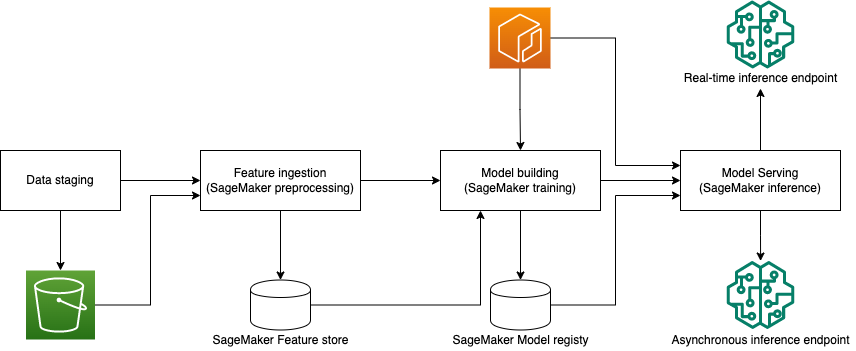

# End to End Pipeline: Bring your own container to SageMaker Pipelines

## Background
Machine learning algorithms are on the rise. With the rapid development of new techniques, we often found new algorithms outdate the current leading algorithms or the popular framework version frequently updating. Making the state-of-the-art algorithms available as built-in algorithms or keeping the prebuilt deep learning framework containers with the latest version can be challenging. In order to use the latest machine learning algorithms with SageMaker, you can Bring Your Own Container (BYOC) to SageMaker or extend a prebuilt SageMaker algorithm or model Docker image to satisfy your needs. For more information about Docker containers with SageMaker, please refer to the [document](https://docs.aws.amazon.com/sagemaker/latest/dg/docker-containers.html). 

In recent years, MLOps has become a hot topic which focus on increasing automation. [Amazon SageMaker Pipelines](https://aws.amazon.com/sagemaker/pipelines/) is the first purpose-built, easy-to-use continuous integration and continuous delivery (CI/CD) service for machine learning (ML). In this example, through the task of text classification, we demonstrate how to integrate SageMaker Pipelines with BYOC solutions to bring the state-of-the-art algorithm to help in the creation and automation of end-to-end ML workflow more efficiently.

## Prerequisites
- Amazon SageMaker notebook instance of `ml.t3.medium` with 50GB EBS, as well as a role with policies of `AmazonSageMakerFullAccess`
- Account limit:
    - 1 x `ml.p3.16xlarge` instance for Training Job
    - 1 x `ml.p3.2xlarge` instance for batch inference
    - 1 x `ml.m5.xlarge` instance for processing jobs
- `us-east-1` is the recommended region to run the example

## Requirements
- sagemaker 2.72.1 or later

## Objective
This repository demonstrates how to create an end2end pipeline at BYOC mode with SageMaker Pipelines. it consists of the following parts:
- Feature ingestion
- Model building
- Real-time inference endpoint deployment
- Asynchronous inference endpoint deployment

## Solution
The whole architecture is like below:
<div align="center"></img></div>

## Dataset
In this repository, we use the dataset of [IMDB](https://ai.stanford.edu/~amaas/data/sentiment/) for text classification. In `tutorial.ipynb`, we use `wget` to download this dataset as below.
```bash
wget https://ai.stanford.edu/~amaas/data/sentiment/aclImdb_v1.tar.gz -O aclImdb_v1.tar.gz
```


## Running Costs

Total cost is estimated to be about $33 with the default parameters. Further cost breakdowns are below.

- Feature ingestion, ml.m5.xlarge, $0.23/h, less than 1h

- Create data, ml.m5.xlarge, $0.23/h, less than 1h

- Training model, ml.p3.16xlarge, $28.152/h, less than 1h

- Test scoring, ml.p3.2xlarge, $3.825/h, less than 1h

- Model quality, ml.m5.xlarge, $3.825/h, less than 1h

- Real-time Inference endpoint, ml.m5.large, $0.115/h, less than 1h
- Asychronous inference endpoint, ml.m5.large, $0.115/h, less than 1h
- SageMaker notebook instance, ml.t3.medium, $0.05/h, about 2h


## Security

See [CONTRIBUTING](CONTRIBUTING.md#security-issue-notifications) for more information.

## License

This library is licensed under the MIT-0 License. See the LICENSE file.
